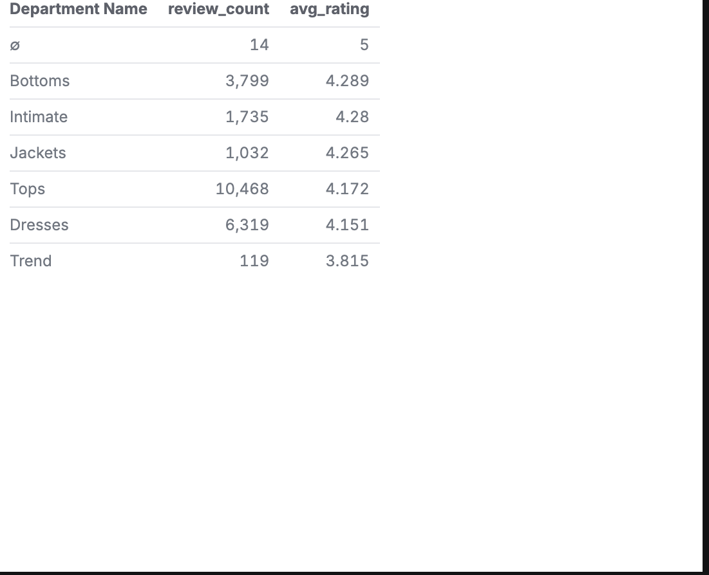
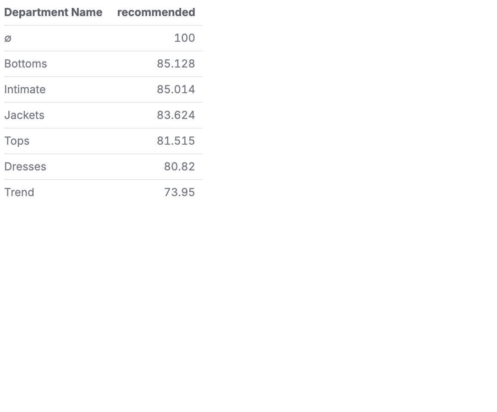
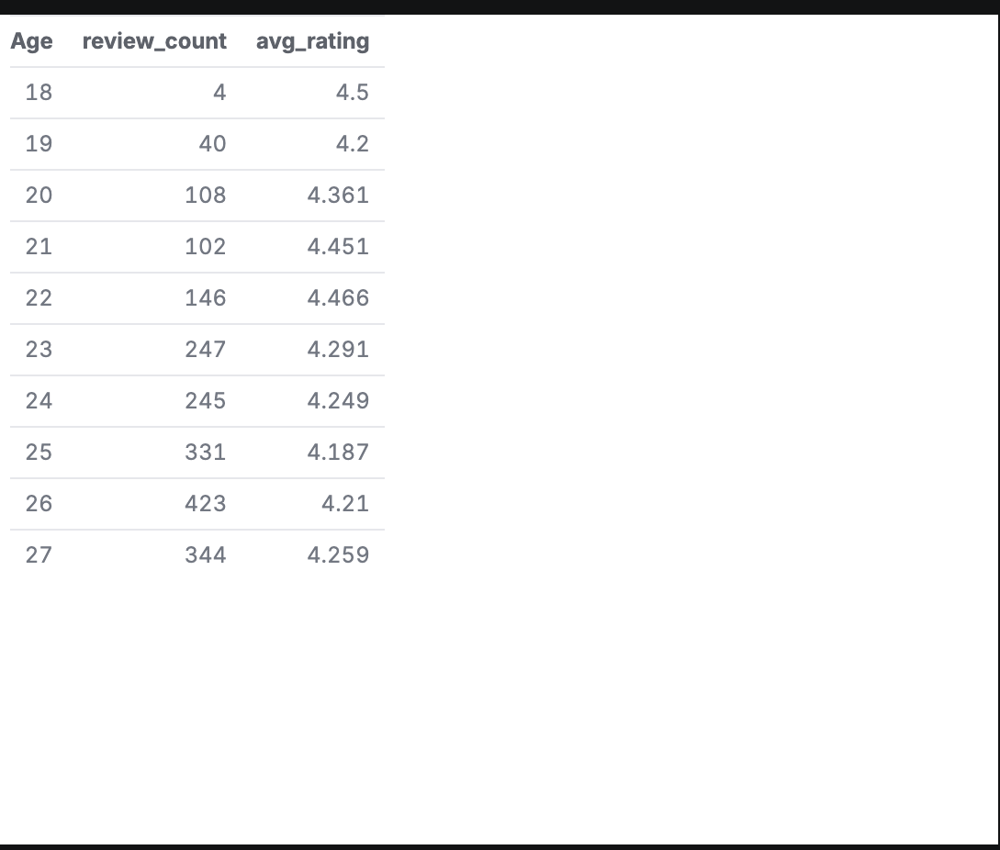

# What Makes Women Happy (With Their Clothes)?
### A Malloy Data Analysis of 23,000 Women's Fashion Reviews

I was curious whether all fashion categories are created equal — 
do women feel the same way about their dresses as their tops? 
Their jackets as their trend pieces? I used Malloy and DuckDB to 
dig into 23,000 reviews from a US women's e-commerce retailer to 
find out.

## The Dataset
This analysis uses the [Women's E-Commerce Clothing Reviews](https://www.kaggle.com/datasets/nicapotato/womens-ecommerce-clothing-reviews) 
dataset from Kaggle — 23,486 reviews across 6 departments: Tops, 
Dresses, Bottoms, Intimate, Jackets, and Trend. The retailer is 
unnamed, which I found interesting — you can't bring pre-conceived 
notions about the brand to the data. However, because we don't know 
the brand, we can't make generalized claims about the whole fashion 
industry.

Each review includes:
- **Age** of the reviewer
- **Rating** (1–5 stars)
- **Whether they recommended the item** (0 or 1)
- **Department and Class** of the clothing item
- **Written review text**

## Finding 1: Tops Dominate, But Trend Disappoints

Tops account for nearly half of all reviews (10,468), making it 
the most-reviewed category by far. But the most surprising finding 
was the Trend department — it had both the lowest average rating 
(3.815) and the lowest recommendation rate (73.95%) of any 
department. Every other department cleared 80% recommendation rate. 
Trend couldn't.

## Finding 2: Recommendation Rates Tell a Clearer Story

When I converted the recommended flag into a percentage, the gap 
became even clearer. Bottoms and Intimates lead at ~85%, while 
Trend trails nearly 12 percentage points behind. For a retailer, 
this is a signal worth paying attention to — trend-driven inventory 
may be generating more returns and disappointment than staple pieces.

## Finding 3: Age Doesn't Predict Satisfaction

I assumed younger shoppers would be harder to please. I was wrong. 
Ratings stay remarkably consistent across all age groups, hovering 
between 4.1 and 4.5 stars from age 18 through the oldest reviewers. 
Satisfaction is not an age story — it's a category story.

## The Story Arc
I started by asking a simple question: which department makes 
customers happiest? The answer surprised me. It's not about 
which category is most popular — Tops wins that easily. It's 
about which category consistently delivers. Trend items generate 
excitement but underdeliver on expectations. Staple categories 
like Bottoms and Intimates quietly lead in customer satisfaction. 
The data suggests that chasing trends may come at a real cost 
to customer loyalty.

## So What?
These findings matter to fashion buyers, merchandisers, and 
e-commerce managers. A retailer investing heavily in trend-driven 
inventory may be optimizing for initial clicks while quietly eroding 
customer trust. The recommendation rate gap between Trend (74%) and 
Bottoms (85%) represents real returns, real dissatisfied customers, 
and real lost repeat business. For anyone making inventory or 
assortment decisions, this data makes a case for balancing trend 
pieces with the reliable staples that customers consistently love.

## Files in This Repo
- `reviews.csv` — cleaned dataset
- `reviews.malloy` — all Malloy queries
- `reviews_story.malloynb` — narrative notebook
- `screenshots/` — query result screenshots

## Reflection
I set out to explore whether all fashion categories are created equal when it comes to customer satisfaction. I chose the Women's E-Commerce Clothing Reviews dataset from Kaggle because it felt directly relevant to my interest in fashion industry careers — and because I wanted to work with real consumer behavior data rather than just product listings. I also thought it would be interesting since it's an unnamed e-commerce brand.
The technical side of this project was not too challenging, but the real issue I had was with embedding my files into my README. There were problems with the files not being found in the seperate "screenshots" folder, but through using Claude I was able to figure it out. 
Once the data was running, the findings came quickly — and some of them genuinely surprised me. I assumed women's fashion satisfaction would be fairly uniform across categories. Instead I found that the Trend department consistently underperformed every other department in both average rating and recommendation rate. Bottoms and Intimates — the least glamorous categories — quietly led in customer satisfaction. I also assumed younger shoppers would be harder to please, but age turned out to be almost irrelevant. Satisfaction was entirely a category story, not a demographic one.
Getting everything onto GitHub was its own challenge. I dealt with merge conflicts, upstream branch errors, broken image paths, and duplicate files from the earlier problems I had with the README file.
If I were to do this again, I would also set up GitHub at the very beginning of the project rather than at the end, which would have made version control much smoother. Finally, I would love to go deeper into the review text itself using some form of sentiment analysis — the written reviews likely contain signals that the star ratings alone don't capture, and that could make for an even richer story.
